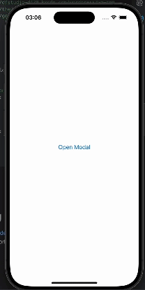

# react-native-image-preview-reanimated

React native image previewer made with Reanimated RNGH

## Installation

```sh
npm install react-native-image-preview-reanimated
```
or with Yarn
```sh
yarn add react-native-image-preview-reanimated
```
If you have already installed Reanimated and React native Gesture Handler you're already setup, else follow these steps

1- Install the packages

Using npm:
```sh
npm install react-native-reanimated react-native-gesture-handler
```
Using yarn:
```sh
yarn add react-native-reanimated react-native-gesture-handler
```
2- Install the pods in the ios project
```sh
cd ios && pod install
```

3- Make sure to add Reanimated babel plugin to babel.config.js

PS: make sure to put it last
```js
module.exports = {
      ...
      plugins: [
          ...
          'react-native-reanimated/plugin',
      ],
  };
```

4- Import react-native-gesture-handler in your index.js file

PS: This is necessary as you may have unexpected crashes/weird behaviors on production
```js
import 'react-native-gesture-handler';
```

## Usage

```js
import { PreviewModal } from 'react-native-image-preview-reanimated';

// ...
<PreviewModal onCloseModal={onCloseModal} isModalOpen={isModalOpen} images={[]}/>
```

## Example
``` typescript jsx
import * as React from 'react';
import { useState } from 'react';

import { Button, StyleSheet, View } from 'react-native';
import { PreviewModal } from 'react-native-image-preview-reanimated';

export default function App() {
  const [isModalOpen, setIsModalOpen] = useState<boolean>(false);
  return (
    <View style={styles.container}>
      <Button title={'Open Modal'} onPress={() => setIsModalOpen(true)} />
      <PreviewModal
        onCloseModal={() => {
          setIsModalOpen(false);
        }}
        isModalOpen={isModalOpen}
        images={[
          'https://sample-videos.com/img/Sample-jpg-image-30mb.jpg',
          'https://img.freepik.com/photos-gratuite/peinture-numerique-montagne-arbre-colore-au-premier-plan_1340-25699.jpg?size=626&ext=jpg&ga=GA1.1.1826414947.1699142400&semt=ais',
          'https://dfstudio-d420.kxcdn.com/wordpress/wp-content/uploads/2019/06/digital_camera_photo-1080x675.jpg',
          'https://theintercept.com/wp-content/uploads/2019/01/GettyImages-1077343584-1547140810-e1547141434550.jpg?fit=5000%2C2500',
          'https://google.com',
          'wys',
        ]}
      />
    </View>
  );
}

const styles = StyleSheet.create({
  container: {
    flex: 1,
    alignItems: 'center',
    justifyContent: 'center',
  },
});

```

## Démo


### Pagination Demo


## Supported Props (others will be added)

| Props                            |  Default  |                                                                 Type                                                                  | Description                                                                                                                                        |
|:---------------------------------|:---------:|:-------------------------------------------------------------------------------------------------------------------------------------:|:---------------------------------------------------------------------------------------------------------------------------------------------------|
| **images**                       |    []     |                                                         ImageSourcePropType[]                                                         | Array of images to be shown                                                                                                                        |
| **isModalOpen**                  |   false   |                                                                boolean                                                                | A boolean defining if the modal is open or not                                                                                                     |
| **isPanGestureEnabled**          |   true    |                                                                boolean                                                                | A boolean defining if the pan gesture is enabled or not  (PS: setting this to false will disable the next/previous gesture and the drag to dismiss |
| **isPinchGestureEnabled**        |   true    |                                                                boolean                                                                | A boolean defining if the pinch gesture is enabled or not                                                                                          |
| **isDoubleTapToZoomEnabled**     |   true    |                                                                boolean                                                                | A boolean defining if the double tap gesture is enabled or not                                                                                     |
| **isSwipeToDismissEnabled**      |   true    |                                                                boolean                                                                | A boolean defining if the modal should swipe to dismiss                                                                                            |
| **onCloseModal**                 |  ()=> {}  |                                                               Function                                                                | executes a callback closing the modal                                                                                                              |
| **CustomPreviousImageComponent** | undefined |                                                           ()=> JSX.Element                                                            | Allows us to set custom previous image component                                                                                                   |
| **CustomNextImageComponent**     | undefined |                                                           ()=> JSX.Element                                                            | Allows us to set custom next image component                                                                                                       |
| **CustomLoadingComponent**       | undefined |                                                           ()=> JSX.Element                                                            | Allows us to set custom image loader component                                                                                                     |
| **errorImageUrl**                | undefined |                                                             Image (local)                                                             | Allows us to set custom error image for failed network images                                                                                      |
| **showPaginationComponent**      |   true    |                                                                boolean                                                                | Allows us to show/hide the pagination component                                                                                                    |
| **modalAnimationIn**             | 'fadeIn'  |     'fadeIn' 'fadeIn-right' 'fadeIn-left' 'fadeIn-top' 'fadeIn-down' 'slideIn-right' 'slideIn-left' 'slideIn-top' 'slideIn-down'      | Allows to set the entering animation for The modal                                                                                                 |
| **imageAnimationIn**             | 'fadeIn'  |     'fadeIn' 'fadeIn-right' 'fadeIn-left' 'fadeIn-top' 'fadeIn-down' 'slideIn-right' 'slideIn-left' 'slideIn-top' 'slideIn-down'      | Allows to set the entering animation for The image                                                                                                 |
| **modalAnimationOut**            | 'fadeOut' | 'fadeOut' 'fadeOut-right' 'fadeOut-left' 'fadeOut-top' 'fadeOut-down' 'slideOut-right' 'slideOut-left' 'slideOut-top' 'slideOut-down' | Allows to set the exiting animation for The modal                                                                                                  |
| **imageAnimationOut**            | 'fadeOut' | 'fadeOut' 'fadeOut-right' 'fadeOut-left' 'fadeOut-top' 'fadeOut-down' 'slideOut-right' 'slideOut-left' 'slideOut-top' 'slideOut-down' | Allows to set the exiting animation for The image                                                                                                  |

## Contributing

See the [contributing guide](CONTRIBUTING.md) to learn how to contribute to the repository and the development workflow.

## License

GPL-2

---

Made with [create-react-native-library](https://github.com/callstack/react-native-builder-bob)
